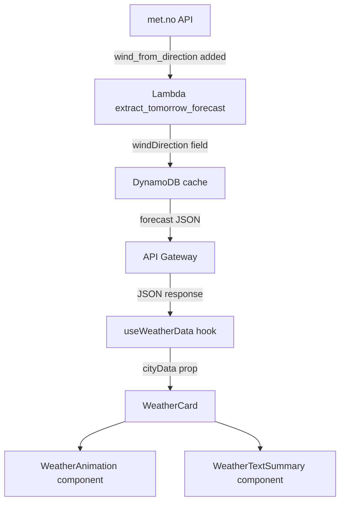

# Design Document: Weather Animation & Text Forecast

## Overview

This feature adds two visual enhancements to each city's `WeatherCard` component:

1. **Weather Animation** — a CSS-only animated scene that visually represents the forecasted condition (sun, rain, snow, etc.)
2. **Text Summary** — a plain-English sentence describing the forecast including temperature, condition, and wind (speed + cardinal direction)

The backend requires a single minor extension: exposing `windDirection` (degrees, 0–360) from the met.no `instant.details.wind_from_direction` field alongside the existing `windSpeed` field.

The frontend changes are self-contained within the `WeatherCard` subtree. No changes to `WeatherDisplay`, routing, or infrastructure are required.

---

## Architecture



**Data flow summary:**
- Lambda extracts `wind_from_direction` from `instant.details` and adds it as `windDirection` to the forecast object stored in DynamoDB and returned via API Gateway.
- The existing `useWeatherData` hook and `WeatherDisplay` pass `cityData` to `WeatherCard` unchanged — the new fields are simply present in `forecast`.
- `WeatherCard` renders two new child components: `WeatherAnimation` and `WeatherTextSummary`, both receiving the `forecast` prop.

---

## Components and Interfaces

### Backend: `extract_tomorrow_forecast` (modified)

The existing function in `src/lambda_handler.py` is extended to read `wind_from_direction` from `instant_data` and include it in `forecast_data`:

```python
# Added to forecast_data dict
"windDirection": instant_data.get("wind_from_direction", None)  # float | None, degrees 0–360
```

The `windSpeed` field (already present as `instant_data.get("wind_speed")`) is confirmed to remain unchanged.

### Frontend: `WeatherAnimation` (new component)

**File:** `frontend/src/components/WeatherAnimation.js` + `WeatherAnimation.css`

**Props:**
```js
WeatherAnimation.propTypes = {
  condition: PropTypes.string,  // normalised condition string, may be null/undefined
}
```

**Behaviour:**
- Maps `condition` to one of 7 animation scenes: `clearsky`, `partlycloudy`, `cloudy`, `rain`, `snow`, `fog`, `thunderstorm`
- Unknown/absent condition falls back to `cloudy` (neutral default)
- Renders purely decorative CSS elements; no images or SVG files
- All motion uses only `transform` and `opacity` CSS properties
- Wraps the scene in `aria-hidden="true"` (purely decorative)
- Respects `prefers-reduced-motion`: static visual preserved, motion removed

**Condition → animation mapping:**

| Condition | Animation scene |
|---|---|
| `clearsky` | Rotating sun with radiating rays |
| `partlycloudy` | Sun partially behind a drifting cloud |
| `cloudy` | Two overlapping clouds drifting slowly |
| `rain` | Falling rain drops (staggered opacity/translateY) |
| `snow` | Falling snowflakes (staggered, slight horizontal drift) |
| `fog` | Horizontal bands fading in/out |
| `thunderstorm` | Rain drops + lightning bolt flash |
| unknown/absent | Same as `cloudy` |

### Frontend: `WeatherTextSummary` (new component)

**File:** `frontend/src/components/WeatherTextSummary.js`

**Props:**
```js
WeatherTextSummary.propTypes = {
  forecast: PropTypes.shape({
    temperature: PropTypes.shape({ value: PropTypes.number }),
    description: PropTypes.string,
    windSpeed: PropTypes.number,      // m/s from API
    windDirection: PropTypes.number,  // degrees 0–360, may be null
  })
}
```

**Behaviour:**
- Converts `windSpeed` from m/s → km/h: `Math.round(windSpeed * 3.6)`
- Derives cardinal/intercardinal label from `windDirection` degrees using 16-point compass (22.5° sectors)
- Produces sentence-case output, e.g.:
  - With wind + direction: `"Partly cloudy with light winds of 12 km/h from the south-west. High of 14°C."`
  - With wind, no direction: `"Partly cloudy with winds of 12 km/h. High of 14°C."`
  - Without wind: `"Partly cloudy. High of 14°C."`
- Rendered as a `<p>` with class `weather-text-summary`

### Frontend: `WeatherCard` (modified)

`WeatherCard.js` is updated to:
1. Import and render `<WeatherAnimation condition={forecast.condition} />` above the emoji icon
2. Import and render `<WeatherTextSummary forecast={forecast} />` below the description
3. Both components are only rendered when not in loading or error state (already gated by existing conditional returns)

---

## Data Models

### Backend forecast object (extended)

```json
{
  "temperature": { "value": 14, "unit": "celsius" },
  "condition": "partlycloudy",
  "description": "Partly Cloudy Day",
  "windSpeed": 3.4,
  "windDirection": 225.0
}
```

`windDirection` is `null` when `wind_from_direction` is absent from the met.no response.

### Wind direction → cardinal label mapping

Uses 16-point compass with 22.5° sectors, centred on each direction:

| Range (degrees) | Label |
|---|---|
| 348.75–360 or 0–11.25 | north |
| 11.25–33.75 | north-north-east |
| 33.75–56.25 | north-east |
| 56.25–78.75 | east-north-east |
| 78.75–101.25 | east |
| 101.25–123.75 | east-south-east |
| 123.75–146.25 | south-east |
| 146.25–168.75 | south-south-east |
| 168.75–191.25 | south |
| 191.25–213.75 | south-south-west |
| 213.75–236.25 | south-west |
| 236.25–258.75 | west-south-west |
| 258.75–281.25 | west |
| 281.25–303.75 | west-north-west |
| 303.75–326.25 | north-west |
| 326.25–348.75 | north-north-west |

### `WeatherForecast` Pydantic model (if applicable)

The existing forecast dict in `lambda_handler.py` does not use a Pydantic model. The `windDirection` field is added as a plain `float | None` in the dict. If a Pydantic model is introduced in future, it should declare:

```python
wind_direction: Optional[float] = Field(None, ge=0, le=360)
```

---

## Correctness Properties

*A property is a characteristic or behavior that should hold true across all valid executions of a system — essentially, a formal statement about what the system should do. Properties serve as the bridge between human-readable specifications and machine-verifiable correctness guarantees.*

### Property 1: Wind speed unit conversion is correct

*For any* non-negative wind speed value in m/s, the `convertWindSpeed` utility should return `Math.round(value * 3.6)` — the exact km/h equivalent rounded to the nearest whole number.

**Validates: Requirements 2.2**

### Property 2: Cardinal direction is valid and periodic for all degree inputs

*For any* degree value `d` in [0, 360], `getCardinalDirection(d)` should return a non-empty string from the 16-label compass set, and `getCardinalDirection(d)` should equal `getCardinalDirection(d % 360)` — the function is periodic with period 360.

**Validates: Requirements 2.3**

### Property 3: Text summary contains required fields when wind is present and uses sentence case

*For any* forecast object with a non-null `windSpeed` and non-null `windDirection`, the generated summary string should contain the temperature value, a km/h wind speed figure, and a cardinal direction label. The string should begin with an uppercase letter and end with a period.

**Validates: Requirements 2.1, 2.2, 2.3, 2.5**

### Property 4: Text summary omits wind when windSpeed is absent

*For any* forecast object where `windSpeed` is null or absent, the generated summary string should contain the temperature and condition description but should not contain "km/h" or any of the 16 cardinal direction labels.

**Validates: Requirements 2.4**

### Property 5: WeatherAnimation renders a condition-specific scene for all known conditions

*For any* condition string from the set `{clearsky, partlycloudy, cloudy, rain, snow, fog, thunderstorm}`, the `WeatherAnimation` component should render at least one DOM element bearing a CSS class that includes the condition name.

**Validates: Requirements 1.1, 1.2**

### Property 6: WeatherAnimation renders the cloudy fallback for unknown or absent conditions

*For any* string not in the known condition set (including null and undefined), the `WeatherAnimation` component should render the same DOM structure as it does for the `cloudy` condition.

**Validates: Requirements 1.3**

### Property 7: windDirection extraction round-trip

*For any* met.no `instant.details` object that contains a `wind_from_direction` value, calling `extract_tomorrow_forecast` and reading back `windDirection` from the result should return the same numeric value (within floating-point tolerance).

**Validates: Requirements 3.1, 3.2**

### Property 8: Missing wind_from_direction yields null windDirection without error

*For any* met.no timeseries entry where `wind_from_direction` is absent from `instant.details`, calling `extract_tomorrow_forecast` should set `windDirection` to `None` in the returned dict and should not raise any exception.

**Validates: Requirements 3.3**

---

## Error Handling

| Scenario | Behaviour |
|---|---|
| `condition` is unknown/absent | `WeatherAnimation` renders `cloudy` fallback; no error thrown |
| `windSpeed` absent from API response | `WeatherTextSummary` omits wind clause; renders temperature + description only |
| `windDirection` absent from API response | Lambda sets `windDirection: null`; frontend omits direction label, still shows speed |
| `wind_from_direction` out of range (< 0 or > 360) | Lambda passes value through; frontend clamps to valid range before lookup |
| Component receives `null` forecast | Both `WeatherAnimation` and `WeatherTextSummary` return `null` (render nothing) — already gated by `WeatherCard` loading/error states |

---

## Testing Strategy

### Dual testing approach

Both unit tests and property-based tests are used. Unit tests cover specific examples and integration points; property tests verify universal correctness across all inputs.

### Backend (Python / pytest + Hypothesis)

**Property-based tests** use [Hypothesis](https://hypothesis.readthedocs.io/) (already a project dependency via `requirements-dev.txt`).

- **Property 7**: `st.floats(min_value=0, max_value=360)` injected into a synthetic timeseries entry → assert `extract_tomorrow_forecast` returns `windDirection` equal to the input value.
  `# Feature: weather-animation-text-forecast, Property 7: windDirection extraction round-trip`
- **Property 8**: Timeseries entries with `wind_from_direction` key absent → assert `windDirection` is `None` and no exception raised.
  `# Feature: weather-animation-text-forecast, Property 8: Missing wind_from_direction yields null windDirection without error`
- Minimum 100 examples per property (`@settings(max_examples=100)`).

**Unit tests** (pytest):
- `wind_from_direction` present → `windDirection` equals that value
- `wind_from_direction` absent → `windDirection` is `None`
- Full `extract_tomorrow_forecast` output shape includes `windDirection` key

### Frontend (JavaScript / Jest + fast-check)

**Property-based tests** use [fast-check](https://fast-check.io/) (already in `devDependencies`, CRA-compatible mapper already configured in `package.json`).

- **Property 1**: `fc.float({ min: 0, max: 200 })` → assert `convertWindSpeed(v) === Math.round(v * 3.6)`
  `// Feature: weather-animation-text-forecast, Property 1: Wind speed unit conversion is correct`
- **Property 2**: `fc.float({ min: 0, max: 360 })` → assert `getCardinalDirection(d)` is a non-empty string from the 16-label set AND equals `getCardinalDirection(d % 360)`
  `// Feature: weather-animation-text-forecast, Property 2: Cardinal direction is valid and periodic for all degree inputs`
- **Property 3**: `fc.record({ temperature: fc.integer(), description: fc.string(), windSpeed: fc.float({ min: 0.1 }), windDirection: fc.float({ min: 0, max: 360 }) })` → assert summary contains km/h value, direction label, starts uppercase, ends with period
  `// Feature: weather-animation-text-forecast, Property 3: Text summary contains required fields when wind is present and uses sentence case`
- **Property 4**: Forecast objects with `windSpeed: null` or absent → assert summary does not contain "km/h"
  `// Feature: weather-animation-text-forecast, Property 4: Text summary omits wind when windSpeed is absent`
- **Property 5**: `fc.constantFrom('clearsky','partlycloudy','cloudy','rain','snow','fog','thunderstorm')` → render `WeatherAnimation`, assert condition-specific CSS class present
  `// Feature: weather-animation-text-forecast, Property 5: WeatherAnimation renders a condition-specific scene for all known conditions`
- **Property 6**: `fc.string()` filtered to exclude known conditions → render `WeatherAnimation`, assert output matches `cloudy` render
  `// Feature: weather-animation-text-forecast, Property 6: WeatherAnimation renders the cloudy fallback for unknown or absent conditions`

Each property test runs minimum 100 iterations (fast-check default is 100).

**Unit tests** (Jest + React Testing Library):
- `WeatherCard` with full forecast renders both `WeatherAnimation` and `WeatherTextSummary`
- `WeatherCard` in loading state renders neither `WeatherAnimation` nor `WeatherTextSummary` (covers Requirements 1.4, 1.5, 2.6)
- `WeatherCard` in error state renders neither `WeatherAnimation` nor `WeatherTextSummary` (covers Requirements 1.5, 2.7)
- `WeatherTextSummary` with wind + direction renders correct sentence
- `WeatherTextSummary` with wind, no direction omits direction clause
- `WeatherTextSummary` with no wind omits wind clause entirely
- `WeatherAnimation` renders correct CSS class for each of the 7 known conditions
- `WeatherAnimation` renders `cloudy` fallback for unknown condition

### Test file locations

| File | Contents |
|---|---|
| `tests/unit/test_lambda_handler.py` | Extended with wind direction extraction tests |
| `frontend/src/components/WeatherAnimation.test.js` | Unit + property tests for animation component |
| `frontend/src/components/WeatherTextSummary.test.js` | Unit + property tests for text summary component |
| `frontend/src/components/WeatherCard.test.js` | Extended with integration tests for new child components |
