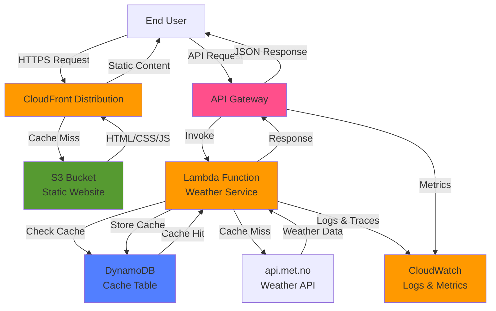
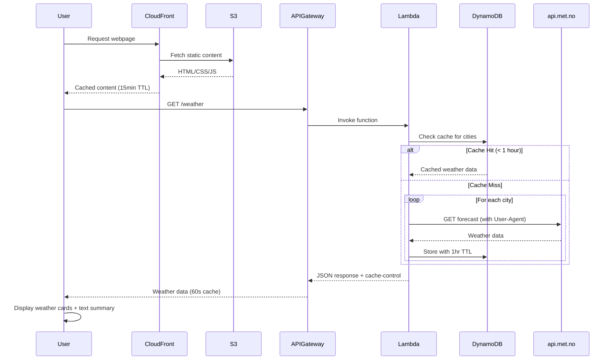

# Weather Forecast App Design Document

## Overview

The weather forecast application is a serverless web application that displays tomorrow's weather forecast for four European cities: Oslo (Norway), Paris (France), London (United Kingdom), and Barcelona (Spain). The application will be deployed on AWS using Terraform infrastructure-as-code and will integrate with the Norwegian Meteorological Institute's weather API.

### Key Design Principles
- **Serverless-first architecture** for minimal operational overhead
- **Mobile-responsive design** for optimal user experience across devices
- **Fast response times** through efficient caching and CDN distribution
- **Well-architected AWS infrastructure** following security and reliability best practices

## Architecture

### High-Level Architecture
The application follows a serverless architecture pattern with the following components:

1. **Frontend**: Static web application hosted on S3 with CloudFront distribution
2. **Backend API**: AWS Lambda functions for weather data processing
3. **Data Layer**: DynamoDB for caching weather data and API rate limiting
4. **External Integration**: Norwegian Meteorological Institute API (api.met.no)

### Architecture Diagram



### Data Flow Sequence Diagram



### Architecture Rationale
- **Static hosting with S3/CloudFront**: Provides fast global content delivery and handles traffic spikes efficiently
- **Lambda functions**: Serverless compute eliminates server management and scales automatically
- **DynamoDB**: NoSQL database perfect for caching weather data with TTL capabilities
- **API Gateway**: Provides managed API endpoints with built-in throttling and monitoring

## Components and Interfaces

### Frontend Components

#### Weather Display Component
- **Purpose**: Renders weather information for all four cities in a responsive grid layout
- **Responsibilities**:
  - Fetch weather data from backend API
  - Display weather information with icons and temperatures
  - Handle loading states and error conditions
  - Adapt layout for mobile devices
  - Display Last updated timestamp from API response
  - Respect cache-control headers from API responses

#### Static Content Delivery
- **Purpose**: Optimize static asset delivery with appropriate caching headers and cost-effective global distribution
- **Configuration**:
  - Set Cache-Control: max-age=900 (15 minutes) for all static assets
  - Apply to HTML, CSS, JavaScript, images, and other static resources
  - Configure both S3 bucket metadata and CloudFront cache behaviors
  - Ensure consistent caching across all static content types
  - Use CloudFront price class 100 (PriceClass_100) for cost optimization while maintaining coverage in Europe and United States
  - Price class 100 includes edge locations in North America, Europe, Asia, Middle East, and Africa
  - Allow only GET, HEAD, and OPTIONS HTTP methods for enhanced security and performance
  - Configure caching policies based on query parameters for optimal cache efficiency
  - Set default TTL to 900 seconds (15 minutes) to align with static content caching strategy

#### City Weather Card Component
- **Purpose**: Individual weather display for each city
- **Properties**:
  - City name and country
  - Temperature (current and forecast)
  - Weather condition icon
  - Weather description

#### Weather Text Summary Component (Star Wars Credits Style)
- **Purpose**: Display a text-based summary of weather forecasts below the main weather cards with a cinematic Star Wars opening credits visual effect
- **Responsibilities**:
  - Render weather information for all four cities in text format
  - Format text in a readable and concise manner
  - Apply Star Wars opening credits visual effect with scrolling animation
  - Implement CSS 3D transforms for perspective and tilted scrolling
  - Adapt layout for mobile devices while maintaining the cinematic effect
  - Handle loading and error states consistently with main display
- **Properties**:
  - Weather data array from API
  - Loading state
  - Error state
  - Animation state (playing, paused)
- **Text Format**:
  - Each city's forecast on a separate line or in a structured paragraph format
  - Include city name, temperature, and weather condition description
  - Example: "Oslo: -2°C, Partly cloudy | Paris: 8°C, Rainy | London: 5°C, Cloudy | Barcelona: 15°C, Sunny"
- **Visual Effect Implementation**:
  - **CSS 3D Transforms**: Use `perspective`, `rotateX`, and `translateZ` for the tilted scrolling effect
  - **Animation**: CSS keyframe animation scrolling text from bottom to top
  - **Perspective Angle**: Approximately 20-25 degrees tilt (rotateX) for authentic Star Wars feel
  - **Scroll Speed**: Configurable animation duration (default: 20-30 seconds for full scroll)
  - **Container Setup**: Fixed-height container with overflow hidden and perspective origin at center
  - **Text Styling**: Large, bold, centered text with appropriate line spacing for readability
  - **Mobile Optimization**: Adjust perspective angle and scroll speed for smaller screens
  - **Performance**: Use CSS transforms and GPU acceleration for smooth animation

### Backend Components

#### Weather Service Lambda
- **Purpose**: Orchestrates weather data retrieval and caching
- **Responsibilities**:
  - Fetch weather data from met.no API with proper User-Agent identification
  - Cache responses in DynamoDB with appropriate TTL
  - Handle API rate limiting and error scenarios
  - Return formatted weather data to frontend
  - Include identifying User-Agent header in all API requests (application name + configurable contact info)
  - Set dynamic cache-control headers based on response success/failure
  - Include lastUpdated timestamp in API responses
- **Configuration**:
  - Company website configurable via environment variable (default: example.com)
  - User-Agent format: "weather-forecast-app/1.0 (+https://[company_website])"
- **Cache-Control Behavior**:
  - Successful API responses: Set cache-control: max-age=60 (1 minute client-side caching)
  - Failed API responses: Set cache-control: max-age=0 (no client-side caching)
- **Timestamp Handling**:
  - Use weather API timestamp when available in response
  - Fall back to DynamoDB cache timestamp when weather API timestamp is not provided
  - Include lastUpdated field in all API responses for frontend display

#### Weather Data Processor
- **Purpose**: Processes and transforms weather data from met.no API
- **Responsibilities**:
  - Parse met.no API responses
  - Extract tomorrow's forecast data
  - Transform data into consistent format
  - Handle different weather condition mappings

### Star Wars Credits Visual Effect - Technical Implementation

#### CSS Architecture
The Star Wars opening credits effect will be implemented using pure CSS3 transforms and animations for optimal performance and browser compatibility.

**HTML Structure**:
```html
<div class="credits-container">
  <div class="credits-content">
    <div class="credits-text">
      <!-- Weather forecast text content -->
    </div>
  </div>
</div>
```

**CSS Implementation**:
```css
.credits-container {
  position: relative;
  height: 400px; /* Adjustable viewport height */
  overflow: hidden;
  perspective: 400px;
  perspective-origin: 50% 50%;
  background: linear-gradient(to bottom, transparent, rgba(0,0,0,0.8));
}

.credits-content {
  position: absolute;
  bottom: 0;
  left: 0;
  right: 0;
  transform-origin: 50% 100%;
  transform: rotateX(25deg);
  animation: scroll-credits 30s linear infinite;
}

.credits-text {
  text-align: center;
  font-size: 1.5rem;
  line-height: 2;
  color: #ffd700; /* Star Wars yellow */
  font-weight: bold;
  padding: 2rem;
}

@keyframes scroll-credits {
  from {
    transform: rotateX(25deg) translateY(100%);
  }
  to {
    transform: rotateX(25deg) translateY(-100%);
  }
}

/* Mobile optimization */
@media (max-width: 768px) {
  .credits-container {
    height: 300px;
    perspective: 300px;
  }

  .credits-content {
    transform: rotateX(20deg);
  }

  .credits-text {
    font-size: 1.2rem;
    line-height: 1.8;
  }

  @keyframes scroll-credits {
    from {
      transform: rotateX(20deg) translateY(100%);
    }
    to {
      transform: rotateX(20deg) translateY(-100%);
    }
  }
}
```

#### Animation Control
- **Auto-play**: Animation starts automatically when component mounts
- **Infinite Loop**: Continuous scrolling with seamless restart
- **Performance**: Uses CSS transforms (GPU-accelerated) instead of JavaScript for smooth 60fps animation
- **Accessibility**: Respects `prefers-reduced-motion` media query for users with motion sensitivity

#### Browser Compatibility
- Modern browsers (Chrome, Firefox, Safari, Edge) with CSS3 transform support
- Graceful fallback: Static text display for older browsers without 3D transform support
- Progressive enhancement approach ensures core functionality works everywhere

### External Interfaces

#### Norwegian Meteorological Institute API
- **Endpoint**: `https://api.met.no/weatherapi/locationforecast/2.0/`
- **Authentication**: None required (public API)
- **User Identification**: All requests must include identifying User-Agent header with application name and contact information as per terms of service
- **Rate Limiting**: Respect terms of service (max 20 requests per second)
- **Data Format**: JSON with comprehensive weather data
- **Caching Strategy**: Cache responses for 1 hour to minimize API calls

## Data Models

### Weather Data Model
```json
{
  "cityId": "oslo",
  "cityName": "Oslo",
  "country": "Norway",
  "coordinates": {
    "latitude": 59.9139,
    "longitude": 10.7522
  },
  "forecast": {
    "date": "2024-01-15",
    "temperature": {
      "value": -2,
      "unit": "celsius"
    },
    "condition": "partly_cloudy",
    "description": "Partly cloudy",
    "icon": "partly_cloudy_day",
    "humidity": 75,
    "windSpeed": 12
  },
  "lastUpdated": "2024-01-14T10:30:00Z",
  "ttl": 1705230600
}
```

### API Response Model
```json
{
  "success": true,
  "data": [
    {
      "cityId": "oslo",
      "cityName": "Oslo",
      "country": "Norway",
      "forecast": {
        "date": "2024-01-15",
        "temperature": {
          "value": -2,
          "unit": "celsius"
        },
        "condition": "partly_cloudy",
        "description": "Partly cloudy",
        "icon": "partly_cloudy_day"
      }
    }
  ],
  "lastUpdated": "2024-01-14T10:30:00Z",
  "cacheControl": "max-age=60"
}
```

### Error Response Model
```json
{
  "success": false,
  "error": "Failed to fetch weather data",
  "data": [],
  "lastUpdated": null,
  "cacheControl": "max-age=0"
}
```

### City Configuration Model
```json
{
  "cities": [
    {
      "id": "oslo",
      "name": "Oslo",
      "country": "Norway",
      "coordinates": { "lat": 59.9139, "lon": 10.7522 }
    },
    {
      "id": "paris",
      "name": "Paris",
      "country": "France",
      "coordinates": { "lat": 48.8566, "lon": 2.3522 }
    },
    {
      "id": "london",
      "name": "London",
      "country": "United Kingdom",
      "coordinates": { "lat": 51.5074, "lon": -0.1278 }
    },
    {
      "id": "barcelona",
      "name": "Barcelona",
      "country": "Spain",
      "coordinates": { "lat": 41.3851, "lon": 2.1734 }
    }
  ]
}
```

## Error Handling

### Frontend Error Handling
- **Network Errors**: Display user-friendly message with retry option
- **API Errors**: Show fallback content or cached data when available
- **Loading States**: Implement skeleton loading for better UX
- **Graceful Degradation**: Show partial data if some cities fail to load

### Backend Error Handling
- **API Rate Limiting**: Implement exponential backoff and circuit breaker pattern
- **External API Failures**: Return cached data when met.no API is unavailable
- **Data Validation**: Validate API responses and handle malformed data
- **Lambda Timeouts**: Set appropriate timeouts and implement retry logic

### Infrastructure Error Handling
- **Multi-AZ Deployment**: Deploy Lambda functions across multiple availability zones
- **CloudFront Failover**: Configure origin failover for high availability
- **DynamoDB Backup**: Enable point-in-time recovery for data protection
- **Monitoring and Alerting**: CloudWatch alarms for critical failures

## Testing Strategy

### Frontend Testing
- **Unit Tests**: Test individual components with Jest and React Testing Library, including the Weather Text Summary component with Star Wars credits effect
  - Test component rendering with weather data
  - Test animation initialization and state management
  - Test CSS class application for 3D transforms
  - Test mobile responsive behavior
- **Integration Tests**: Test API integration and data flow, ensuring text summary displays correctly with weather data and animation triggers properly
- **Visual Regression Tests**: Ensure UI consistency across devices, including text summary layout and Star Wars credits animation
  - Capture screenshots at different animation states
  - Validate perspective transform rendering
  - Test animation smoothness and performance
- **Accessibility Tests**: Validate WCAG compliance for mobile and desktop, ensuring text summary is accessible
  - Test `prefers-reduced-motion` media query support
  - Validate keyboard navigation and focus management
  - Ensure text remains readable during animation
- **Animation Tests**: Validate Star Wars credits effect implementation
  - Test CSS animation keyframes are applied correctly
  - Verify 3D transform calculations
  - Test animation performance (60fps target)
  - Validate infinite loop behavior

### Backend Testing
- **Unit Tests**: Test Lambda functions with mocked dependencies
- **Integration Tests**: Test DynamoDB operations and external API calls
- **Load Tests**: Validate performance under expected traffic patterns
- **Contract Tests**: Ensure API compatibility between frontend and backend

### Infrastructure Testing
- **Terraform Validation**: Use terraform validate and terraform plan
- **Security Scanning**: Implement Checkov for infrastructure security
- **Cost Analysis**: Validate infrastructure costs against budget constraints
- **Deployment Tests**: Test infrastructure deployment in staging environment

### End-to-End Testing
- **User Journey Tests**: Automate critical user paths
- **Cross-Browser Testing**: Validate functionality across major browsers
- **Mobile Device Testing**: Test responsive design on various screen sizes
- **Performance Testing**: Validate page load times and API response times

## Security Considerations

### API Security
- **CORS Configuration**: Restrict origins to application domain
- **Rate Limiting**: Implement API Gateway throttling
- **Input Validation**: Sanitize and validate all inputs
- **Error Message Sanitization**: Avoid exposing sensitive information

### Infrastructure Security
- **IAM Least Privilege**: Grant minimal required permissions
- **VPC Configuration**: Deploy Lambda functions in private subnets when needed
- **Encryption**: Enable encryption at rest and in transit
- **Security Groups**: Restrict network access to required ports only

### Data Protection
- **No PII Storage**: Weather data contains no personally identifiable information
- **Data Retention**: Implement TTL for cached weather data
- **Audit Logging**: Enable CloudTrail for infrastructure changes
- **Compliance**: Follow CIS AWS Security Hub control standards

## Performance Optimization

### Frontend Performance
- **Code Splitting**: Lazy load components for faster initial load
- **Image Optimization**: Use WebP format with fallbacks
- **Static Content Caching**: Configure Cache-Control headers with Max-Age=900 (15 minutes) for all static assets including HTML, CSS, JavaScript, and images
- **CDN Distribution**: Leverage CloudFront for global content delivery with optimized cache behaviors
- **Animation Performance**: Optimize Star Wars credits effect for smooth rendering
  - Use CSS transforms (translateY, rotateX) for GPU acceleration
  - Avoid JavaScript-based animations for better performance
  - Use `will-change: transform` hint for browser optimization
  - Implement `prefers-reduced-motion` for accessibility and performance
  - Minimize repaints and reflows during animation
  - Target 60fps animation frame rate

### Backend Performance
- **Connection Pooling**: Reuse database connections in Lambda functions
- **Caching Layer**: Cache weather data in DynamoDB with 1-hour TTL
- **Lambda Optimization**: Right-size memory allocation for optimal performance
- **API Response Compression**: Enable gzip compression for API responses

### Infrastructure Performance
- **CloudFront Configuration**: Configure cache behaviors with Cache-Control headers (Max-Age=900) for static content and optimize TTL settings
- **CloudFront Price Class**: Use price class 100 (PriceClass_100) to optimize costs while maintaining coverage for Europe and United States edge locations
- **CloudFront HTTP Methods**: Restrict to GET, HEAD, and OPTIONS methods for security and performance optimization
- **CloudFront Caching Policy**: Configure query parameter-based caching for optimal cache efficiency
- **CloudFront Default TTL**: Set to 900 seconds (15 minutes) to align with static content caching requirements
- **S3 Static Hosting**: Configure S3 bucket metadata to set appropriate Cache-Control headers for static assets
- **DynamoDB Provisioning**: Use on-demand billing for variable workloads
- **Lambda Cold Start Optimization**: Minimize package size and initialization time
- **Regional Deployment**: Deploy in eu-west-1 for optimal European latency

## Monitoring and Observability

### Application Monitoring
- **CloudWatch Dashboards**: Custom dashboard for weather app metrics
- **X-Ray Tracing**: Distributed tracing for Lambda functions
- **Custom Metrics**: Track weather API success rates and response times
- **Log Aggregation**: Centralized logging with 180-day retention

### Infrastructure Monitoring
- **CloudWatch Alarms**: Monitor Lambda errors, DynamoDB throttling, and API Gateway 5xx errors
- **Cost Monitoring**: AWS Budget alerts based on Service tag
- **Performance Metrics**: Track response times, throughput, and error rates
- **Health Checks**: Monitor application endpoints and external API availability

### Alerting Strategy
- **Critical Alerts**: Immediate notification for service outages
- **Warning Alerts**: Proactive alerts for performance degradation
- **Cost Alerts**: Budget threshold notifications
- **Operational Alerts**: Infrastructure changes and deployment notifications

## Deployment Strategy

### Infrastructure Deployment
- **Terraform Modules**: Organized as reusable Terraform modules
- **Environment Separation**: Separate configurations for staging and production
- **Blue-Green Deployment**: Zero-downtime deployments for Lambda functions
- **Rollback Strategy**: Automated rollback on deployment failures

### Application Deployment
- **CI/CD Pipeline**: Automated testing and deployment pipeline
- **Staging Environment**: Full environment for pre-production testing
- **Feature Flags**: Gradual feature rollout capabilities
- **Monitoring Integration**: Deployment success validation through metrics

### Disaster Recovery
- **Multi-Region Strategy**: Primary deployment in eu-west-1 with failover capability
- **Data Backup**: DynamoDB point-in-time recovery enabled
- **Infrastructure as Code**: Complete infrastructure reproducibility
- **Recovery Testing**: Regular disaster recovery drills and validation