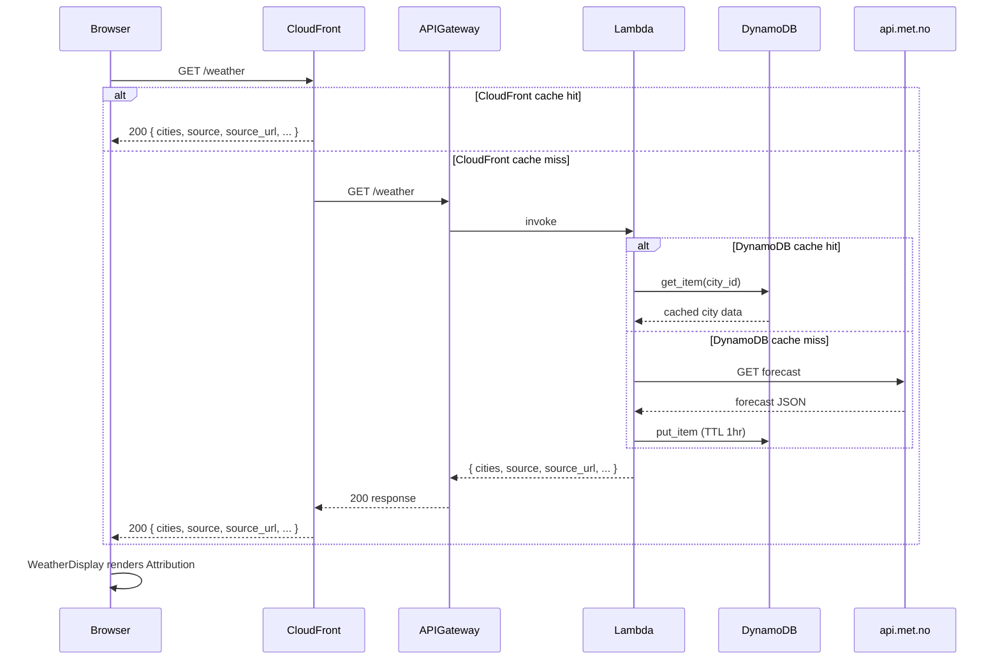

# Design Document: weather-forecast-source

## Overview

This feature adds visible data source attribution to the weather forecast application. The Norwegian Meteorological Institute (api.met.no) supplies all forecast data, and users should see that credit on every page load — including when data is served from cache.

The change touches two layers:

1. **Backend (Lambda)**: Add `source` and `source_url` static fields to the `/weather` API response.
2. **Frontend (React)**: Render an `Attribution` component inside `WeatherDisplay` that reads those fields and displays a labelled hyperlink.

The attribution is intentionally static — the provider never changes — so the backend simply injects the values into every response (fresh fetch and cache hit alike). The frontend renders it unconditionally whenever forecast data is on screen.

## Architecture



No new AWS resources are required. The change is purely additive to the existing Lambda response and React component tree.

## Components and Interfaces

### Backend: `get_weather_summary()` in `lambda_handler.py`

The `get_weather_summary` function currently returns:

```python
{
    "cities": [...],
    "lastUpdated": "...",
    "status": "success" | "partial_failure",
    "hasErrors": bool
}
```

It will be extended to always include:

```python
{
    "cities": [...],
    "lastUpdated": "...",
    "status": "...",
    "hasErrors": bool,
    "source": "Norwegian Meteorological Institute",
    "source_url": "https://api.met.no"
}
```

These two fields are constants defined at module level and injected unconditionally — they are independent of whether data came from DynamoDB cache or a live API call.

### Frontend: `Attribution` component

A new `Attribution` component renders the provider credit:

```jsx
// frontend/src/components/Attribution.js
const Attribution = ({ source, sourceUrl }) => (
  <p className="attribution">
    Data source:{' '}
    <a
      href={sourceUrl}
      target="_blank"
      rel="noopener noreferrer"
      className="attribution__link"
    >
      {source}
    </a>
  </p>
);
```

### Frontend: `WeatherDisplay` integration

`WeatherDisplay` already receives the full API response via `useWeatherData`. It will pass `weatherData.source` and `weatherData.source_url` to `Attribution`, rendering it in both the normal forecast view and the global error view (so attribution is always visible when any data is on screen).

```jsx
{weatherData && (
  <Attribution
    source={weatherData.source}
    sourceUrl={weatherData.source_url}
  />
)}
```

### Frontend: `weatherApi.js`

No changes required. The client already returns the full parsed JSON body; the new `source` and `source_url` fields will be present automatically.

## Data Models

### API Response (extended)

```json
{
  "cities": [
    {
      "cityId": "oslo",
      "cityName": "Oslo",
      "country": "Norway",
      "forecast": {
        "temperature": { "value": 12, "unit": "celsius" },
        "condition": "partly_cloudy",
        "description": "Partly Cloudy Day"
      },
      "lastUpdated": "2025-01-15T12:00:00Z"
    }
  ],
  "lastUpdated": "2025-01-15T12:00:00Z",
  "status": "success",
  "hasErrors": false,
  "source": "Norwegian Meteorological Institute",
  "source_url": "https://api.met.no"
}
```

`source` and `source_url` are top-level string fields. They are always present regardless of cache state or partial failures.

### DynamoDB cache

The DynamoDB cache stores per-city forecast data only. The `source` and `source_url` fields are not stored in DynamoDB — they are injected by `get_weather_summary()` after all city data is assembled. This means cache hits and misses both produce identical attribution fields with zero schema migration.

### Attribution CSS

```css
/* Attribution.css */
.attribution {
  font-size: 0.75rem;   /* smaller than WeatherCard secondary text (~0.875rem) */
  color: rgba(255, 255, 255, 0.75);
  text-align: center;
  margin: 1.5rem auto 0;
}

.attribution__link {
  color: rgba(255, 255, 255, 0.9);
  text-decoration: underline;
}

@media (prefers-color-scheme: dark) {
  /* gradient already switches to dark in WeatherDisplay.css;
     rgba values remain legible on both light and dark backgrounds */
}

@media (prefers-contrast: high) {
  .attribution,
  .attribution__link {
    color: #ffffff;
    text-decoration: underline;
  }
}
```


## Correctness Properties

*A property is a characteristic or behavior that should hold true across all valid executions of a system — essentially, a formal statement about what the system should do. Properties serve as the bridge between human-readable specifications and machine-verifiable correctness guarantees.*

### Property 1: WeatherDisplay renders attribution name and link

*For any* `weatherData` object that includes `source` and `source_url` fields, rendering `WeatherDisplay` should produce output that contains the provider name and an anchor element whose `href` equals `https://api.met.no`.

**Validates: Requirements 1.1, 1.2**

### Property 2: API response always contains source fields

*For any* invocation of `get_weather_summary()` — regardless of whether city data came from DynamoDB cache or a live API fetch — the returned dict must contain `source == "Norwegian Meteorological Institute"` and `source_url == "https://api.met.no"`.

**Validates: Requirements 2.1, 2.2, 2.3, 3.1**

### Property 3: Source fields present even on total fetch failure

*For any* scenario where all city weather fetches fail (network error, API error, or exception), the response from `get_weather_summary()` must still contain `source` and `source_url` with their static values.

**Validates: Requirements 2.4**

## Error Handling

**Backend**:
- `source` and `source_url` are module-level constants injected unconditionally in `get_weather_summary()`. There is no code path that can omit them, including the partial-failure and total-failure paths.
- If `get_weather_summary()` itself raises an unhandled exception, `handle_weather_request()` returns a 502/500 error response. In that case no `source` field is present — but no forecast data is present either, so the frontend shows the global error state (no Attribution rendered).

**Frontend**:
- `Attribution` is only rendered when `weatherData` is non-null. During loading or global error states, `weatherData` is null and no Attribution is shown — consistent with no forecast data being displayed.
- If `source` or `source_url` are missing from a valid response (defensive case), the `Attribution` component receives `undefined` props. The link will still render but with an empty `href`; this is acceptable as a graceful degradation.

## Testing Strategy

### Unit tests

**Backend** (`tests/unit/test_lambda_handler.py`):
- Verify `get_weather_summary()` includes `source` and `source_url` in a normal success response (mocked DynamoDB cache hit).
- Verify `get_weather_summary()` includes `source` and `source_url` when all city fetches raise exceptions.

**Frontend** (`frontend/src/components/Attribution.test.js`):
- Render `Attribution` with known props and assert the link text and `href` are correct (example test).

**Frontend** (`frontend/src/components/WeatherDisplay.test.js`):
- Extend existing tests: when `weatherData` includes `source`/`source_url`, assert the Attribution link is present in the rendered output.

### Property-based tests

The project uses **fast-check** (v4, already installed) with Jest on the frontend, and **pytest** with **hypothesis** on the backend.

**Property 1 — frontend** (`Attribution.test.js`):
```js
// Feature: weather-forecast-source, Property 1: WeatherDisplay renders attribution name and link
fc.assert(
  fc.property(
    fc.record({ source: fc.string(), source_url: fc.webUrl() }),
    (data) => {
      const { getByRole } = render(<Attribution source={data.source} sourceUrl={data.source_url} />);
      const link = getByRole('link');
      expect(link).toHaveTextContent(data.source);
      expect(link).toHaveAttribute('href', data.source_url);
    }
  ),
  { numRuns: 100 }
);
```

**Property 2 — backend** (`tests/unit/test_lambda_handler.py`):
```python
# Feature: weather-forecast-source, Property 2: API response always contains source fields
@given(st.lists(city_strategy(), min_size=1, max_size=4))
@settings(max_examples=100)
def test_source_fields_always_present(mock_cities):
    with patch(...):  # mock DynamoDB and API
        result = get_weather_summary()
    assert result["source"] == "Norwegian Meteorological Institute"
    assert result["source_url"] == "https://api.met.no"
```

**Property 3 — backend** (`tests/unit/test_lambda_handler.py`):
```python
# Feature: weather-forecast-source, Property 3: Source fields present even on total fetch failure
@given(st.lists(city_strategy(), min_size=1, max_size=4))
@settings(max_examples=100)
def test_source_fields_present_on_failure(mock_cities):
    with patch('src.lambda_handler.fetch_weather_data', side_effect=Exception("network error")):
        with patch('src.lambda_handler.get_cached_weather_data', return_value=None):
            result = get_weather_summary()
    assert result["source"] == "Norwegian Meteorological Institute"
    assert result["source_url"] == "https://api.met.no"
```

Each property test runs a minimum of 100 iterations. Backend property tests use **hypothesis** (`pip install hypothesis`). Frontend property tests use **fast-check** with the existing `moduleNameMapper` configuration in `package.json`.
